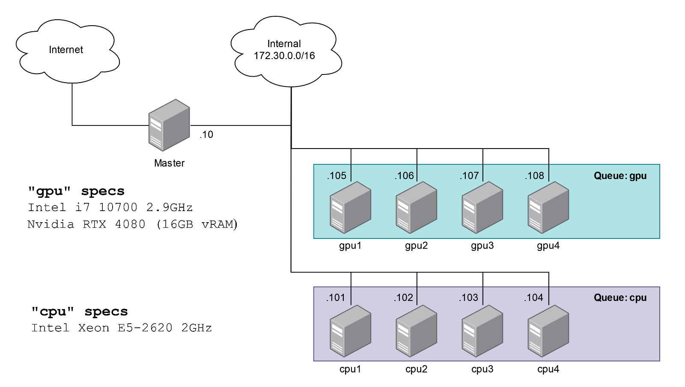
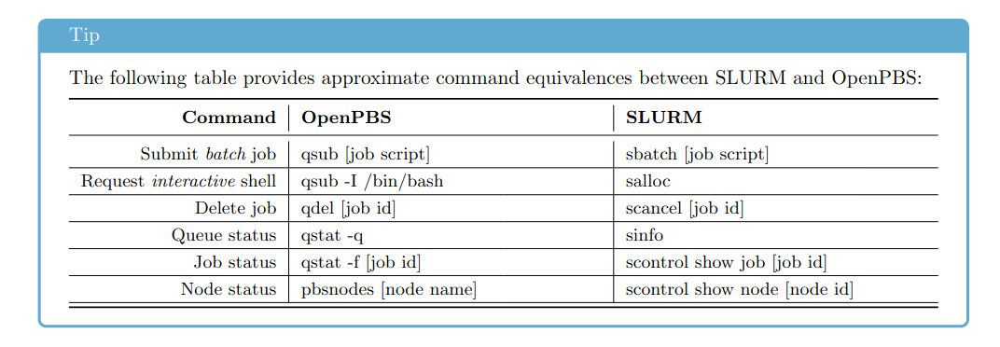

# Preparing the hardware

1. Disable _Fast Boot_
2. Disable _Secure Boot_
3. Disable _Fast memmory_
4. Switch (if needed) from UEFI to CSM mode
5. Place (non-UEFI) network as the #1 boot option

# Pararelism specifications

## GPU nodes
- __Sockets__: 1
- __Cores per socket__: 8
- __Thread per core__: 2

## GPU nodes
- __Sockets__: 2
- __Cores per socket__: 6
- __Thread per core__: 1

# Specifications

## MAC's

| **Node** | **MAC**           |
|----------|-------------------|
| cpu1     | 08:9E:01:82:A8:49 |
| cpu2     | 08:9E:01:82:A8:40 |
| cpu3     | 08:9E:01:82:A6:75 |
| cpu4     | 08:9E:01:82:A9:A8 |
| gpu1     | D8:BB:C1:8A:AA:85 |
| gpu2     | D8:BB:C1:8A:AA:95 |
| gpu3     | D8:BB:C1:8A:AA:05 |
| gpu4     | D8:BB:C1:8A:A9:D9 |

## Network

# Set up
Our setup assumes you start from a system with Rocky Linux 9.X installed. The setup process is separated on to two parts:
- `stage1.sh`
- `stage2.sh`
 
The first script sets up the whole cluster architecture, while the second one installs packages and comunicates the slaves with the master.
__NOTE: You are expected to power up slave nodes between both scripts.__

[Link](https://github.com/openhpc/ohpc/releases/download/v2.8.GA/Install_guide-Rocky8-Warewulf-SLURM-2.8-x86_64.pdf) to install guide followed.

